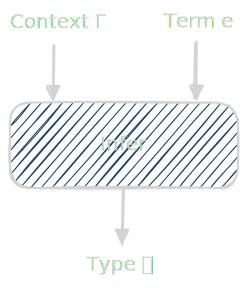
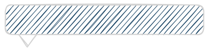
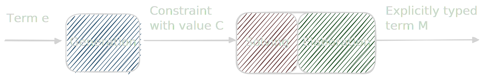

# Omnidirectional type inference for ML


<div class="faces">
  <figure class="face">
    
    <figcaption>
      <div class="author">Alistair O’Brien</div>
      <div class="affiliation">University of Cambridge</div>
    </figcaption>
  </figure>

  <figure class="face">
    
    <figcaption>
      <div class="author">Didier Remy</div>
      <div class="affiliation">Inria, Paris</div>
    </figcaption>
  </figure>

  <figure class="face">
    
    <figcaption>
      <div class="author">Gabriel Scherer</div>
      <div class="affiliation">Inria &amp; IRIF, Paris</div>
    </figcaption>
  </figure>
</div>


### _WITS 2026_

{pause up}
# Our type inference ideology

<div class="vspace-lg"></div>

{style="display: grid; grid-template-columns: 1fr 1fr; gap: 4em"}
> {pause}
> 
> 
> <div>
>
> {pause}
> <div class="vspace-lg"></div>
>
> - <span class="em-1">**Scalability**</span>
>
>   {pause}
>   Many complex features in OCaml (*e.g.* static overloading)
>
> {pause}
> <div class="vspace-lg"></div>
>
> - Some <span class="em-2">**annotations are ok**</span>
>
> {pause}
> <div class="vspace-lg"></div>
>
> - Inference must be <span class="em-3">**efficient**</span>
>
> </div>

{pause}
```ocaml
val infer : env:Env.t -> expr -> type_expr
```

{pause up}
# Bidirectional typing

<div class="vspace-lg"></div>

{pause}
Split type checker `infer` into *two modes*: 
   
  <div class="vspace-md"></div>

  {pause}
  - <span class="em-4">**Checking**</span>: $\Gamma \vdash e \Leftarrow \tau$
      ```ocaml
      val check : env:Env.t -> expr -> type_expr -> unit
      ```

  <div class="vspace-md"></div>

  {pause}
  - <span class="em-1">**Inference**</span>: $\Gamma \vdash e \Rightarrow \tau$ 
      ```ocaml
      val infer : env:Env.t -> expr -> type_expr
      ```


{pause}
<div class="vspace-lg"></div>

Types are propagated to leafward/neighbouring terms


{pause up}
# Bidirectional typing: overloading 

{#point-typedef pause}
```ocaml
type point = { x : int; y : int }
type 'a gpoint = { x : 'a; y : 'a }
```

{pause}
<div class="vspace-lg"></div>

Fields `x` and `y` are *statically overloaded*

<div class="vspace-lg"></div>

{pause}
```ocaml
let getx = fun (p : point) -> p.x
```


{pause}


{#p-is-known class="hidden" style="position: absolute; left: 55%"}
> 
> <div style="position: absolute; left: 17%; top: 13%">
> <mjx-math><mjx-mtext><mjx-c class="mjx-c1D699 NCM-M">p</mjx-c></mjx-mtext></mjx-math>'s type is <span class="em-3">known</span>
> </div>

<div style="height: 80px"></div>


```math
\frac
  {\texttt{p} : \texttt{point} \vdash \texttt{p} \Rightarrow \texttt{point}}
  {\texttt{p} : \texttt{point} \vdash \texttt{p.x} \Rightarrow \texttt{int}}
```

{pause exec}
```slip-script
let el = document.querySelector("#p-is-known")
slip.setClass(el, "hidden", false)
```

<div class="vspace-lg"></div>

- <span class="em-3">Known</span> = output of `infer`/ input to `check`


{pause up}
# Fixed directionality

<div class="vspace-lg"></div>

*Flow of type information is <span class="problem">fixed</span> by the typing rules*


{pause}
<div class="vspace-lg"></div>

```ocaml
let infer ~env = function
  | Eapp (e1, e2) -> 
      let Tarrow (te1, te2) = infer ~env e1 in
      let () = check ~env e2 te1 in
      te2
```

{#fixed-order-bidir pause}
Fixed order:
{pause}
1. <span class="em-1">Infer</span> the function $e_1$, returns $\tau_1 \to \tau_2$
{pause}
2. <span class="em-4">Check</span> the argument $e_2$ against $\tau_1$
{pause}
3. <span class="em-1">Infer</span> $e_1 \; e_2$, returns $\tau_2$

<div class="vspace-lg"></div>

{pause up=fixed-order-bidir}

{.does-compile}
```ocaml
(fun (p : point) -> p.x) { x = 42; y = 1337 }
```


<div class="vspace-md"></div>

{pause}

{.does-not-compile}
```ocaml
(fun p -> p.x) ({ x = 42; y = 1337 } : point)
```

{pause}

<pre>
|  (fun p -> p.x) ({ x = 42; y = 1337 } : point)
               ^

Error: x belongs to several types: gpoint point
</pre>

{pause up}
# The French approach: constraints!

{pause}

The essence of ML type inference <span class="em-5">[Pottier and Remy, 2005]</span>

{pause #constraint-pipeline}

<div class="vspace-lg"></div>



{pause} 

<div class="vspace-lg"></div>

```ocaml
let constraint_gen te = function
  | Eapp (e1, e2) -> 
    exists @@ fun tv ->
    constraint_gen (Tarrow (tv, te)) e1 
    && constraint_gen tv e2 
```

{pause up=constraint-pipeline}

Many advantages!
{pause}
1. Constraint generation: many cases but easy code!
{pause}
2. Constraint solving: few cases, very tricky!
{pause}
3. Solving in any order!

{pause up}
# The problem

<div class="vspace-xl"></div>

<div style="display: flex; justify-content: center">

<table>
    <thead>
      <tr>
        <th></th>
        <th>Constraint-based</th>
        <th>Bidirectional</th>
      </tr>
    </thead>
    <tbody>
      <tr>
        <td>Efficient</td>
        <td class="tick">✓</td>
        <td class="tick">✓</td>
      </tr>
      <tr>
        <td>Expressive</td>
        <td class="cross">✗</td>
        <td class="tick">✓</td>
      </tr>
      <tr>
        <td>No Fixed Order</td>
        <td class="tick">✓</td>
        <td class="cross">✗</td>
      </tr>
    </tbody>
</table>

</div>

{pause}

<div class="vspace-lg"></div>

Not solved by: 
- Let arguments go first <span class="em-5">[Xie and Oliveria, 2018]</span>
{pause}
- Contextual typing <span class="em-5">[Xue and Oliveria, 2024]</span>

{pause up}
# Omnidirectionality

{pause}

<span class="key-idea">*Key idea*</span>: If we don't have the required known type information yet, <span class="solution">**wait**</span>.

<div class="vspace-lg"></div>

{#omni-match pause}

```math
\textsf{match } \alpha \textsf{ with } f
```

$\alpha$: unification variable

$f$: function from type *shapes* to constraints

{pause}
```ocaml
type type_shape = 
  | Sunit
  | Sarrow of type_expr * type_expr
```

{pause center}

<div class="vspace-lg"></div>

<span class="solution">*Waits*</span> on $\alpha$ to be unified:
{pause}
- when $\alpha$ unifies with some non-variable type $\tau_0$
{pause}
- then solve $f(\textsf{shape}(\tau_0))$

{pause}
<div class="vspace-lg"></div>

<span class="problem">*Otherwise*</span> if $\alpha$ is never unified, fail

{pause} 

<div class="vspace-sm"></div>

Introduces a <span class="em-4">*dynamic*</span> order for inference (propagation via unification).

{pause up}
# Implementation: STLC

<div class="vspace-lg"></div>

```ocaml
type type_expr = 
  | Tvar of type_var ref
  | Tunit
  | Tarrow of type_expr * type_expr
```

{pause carousel #type-var}
> ```ocaml
> type type_var =
>   | Null
>   | Link of type_expr
> ```
>
> ```ocaml
> type type_var =
>   | Null of (type_shape -> unit) list
>   | Link of type_expr
> ```

{pause change-page="~n:3 type-var"}

<div class="vspace-lg"></div>

Implemented using <span class="key-idea">*wait lists*</span> on variables

{pause}

Infers <span class="em-4">*principal*</span> types!

{pause up}
# Next challenge: `let`-polymorphism

<div class="vspace-lg"></div>

Let bindings <span class="key-idea">*generalize*</span> types into polymorphic ones


<div class="vspace-lg"></div>

{pause}

```ocaml
let id = fun x -> x
```

{.no-background pause}
```ocaml
val id : 'a -> 'a
```


{pause} 

<div class="vspace-lg"></div>

<span class="key-idea">Generalization</span>: which inference variables $\alpha$ are <span class="em-2">*local*</span> and can be generalized into polymorphic variables.


<div class="vspace-lg"></div>

{#infer-let pause center}

```ocaml
let rec infer ~env = function
  | Elet (x, e1, e2) ->
    let te_x = 
      with_local_level_generalize (fun () -> 
        infer ~env e1)
    in
    infer ~env:(Env.bind env x te_x) e2
```

<div class="vspace-lg"></div>

{pause up=infer-let}

Fixed order:
{pause}
1. <span class="em-1">Infer</span> the type of `e1`
{pause}
2. <span class="key-idea">Generalize</span> `te_x`
{pause}
3. Use generalized type `te_x` when <span class="em-1">inferring</span> `e2`

<div class="vspace-lg"></div>

{pause}
Omnidirectionality *cannot* work with a <span class="problem">fixed order</span>

{pause up}
# Where `let` breaks

<div class="vspace-lg"></div>

<div class="vspace-lg"></div>

```ocaml
let difficult_lemon_difficult q = 
  let getx p = p.x in
  (getx q : float), getx ({ x = 42; y = 1337 } : int gpoint)
```

<div class="vspace-lg"></div>

{#let-problem pause}
At the point of generalization:
1. `p.x` is suspended

{pause}

2. Both `p` and the return type of `getx` may or may not be generalized

   {pause}

   Their types are <span class="problem">*guarded*</span> by `p.x`'s suspended match constraint

{pause}

<div class="vspace-lg"></div>

*How to generalize guarded variables?*

<div class="vspace-lg"></div>

{pause up=let-problem}
**Solutions?**

<div class="vspace-md"></div>

{pause}
1. Qualified types? {pause} <span class="cross">✗</span>
   
   `getx` : $\texttt{HasField} \; \texttt{x} \; \alpha \; \beta \Rightarrow \alpha \to \beta$ \
   $\Rightarrow$ dynamic overloading!


{pause center}
2. Can we make `let` monomorphic (like GHC)? {pause} <span class="cross">✗</span>
   
   Nope, `getx` is instantiated for `int gpoint` and `float gpoint`

{pause}
3. Suspend all instantiations of `getx`? {pause} <span class="cross">✗</span>

   Nope, inference gets stuck


{pause up}
# Partial generalization

<div class="vspace-lg"></div>

{pause}
<span class="key-idea">*Key idea</span>: We can generalize/instantiate incrementally*

<div class="vspace-lg"></div>

{#partial-generalize pause}
<span class="key-idea">Partial generalization</span> of $\tau$:
{pause}
- Generalize what is <span class="solution">*known*</span> (unguarded)
{pause}
- If $\beta$ is <span class="problem">guarded</span>, treat as polymorphic and <span class="em-4">patch</span> instantiations later 

<div class="vspace-lg"></div>


{#example pause up=partial-generalize}

```ocaml
let difficult_lemon_difficult q = 
  let getx p = p.x in
  (getx q : float), getx ({ x = 42; y = 1337 } : int gpoint)
```


{pause}
1. Start with a <span class="key-idea">partial type scheme</span> `getx` : $\forall \alpha, \beta.\; \alpha \to \beta \mid \textsf{match } \alpha \textsf{ with } \ldots$

{pause}
2. Instantiate `getx` twice

{pause}
3. `getx (... : int gpoint)` unifies $\alpha$ to $\gamma \; \texttt{gpoint}$.

{pause}
4. Match constraint on $\alpha$ unifies $\beta$ to $\gamma$. \
   <span class="key-idea">Partial scheme</span> now: $\forall \gamma.\; \gamma \texttt{ gpoint} \to \gamma$.

{pause}
5. <span class="em-4">Update</span> all instances of `getx`: $\alpha \mapsto \gamma' \texttt{ gpoint}$ and $\beta \mapsto \gamma'$


<div class="vspace-lg"></div>

{pause up=example}

Delicate to implement. {pause} Difficult to implement *efficiently*


{pause up}
# Summary

{pause}
<div class="vspace-lg"></div>

Omnidirectionality provides expressive, efficient and principal type inference.

{pause}
<div class="vspace-lg"></div>

{style="display: grid; grid-template-columns: 1fr 2fr; gap: 2em"}
> {pause}
> <div>
> Check out our paper!
> 
> </div>
> 
> <div>
> Principal and declarative specification for many other features 
>
> Sound and complete constraint-based inference algorithm 
>
> A formalized efficient constraint solver 
>
> An efficient in-practice implementation
> </div>

{pause}

{style="text-align: center"}
>
> ### Thanks for listening! 
>
> ## Questions? 

